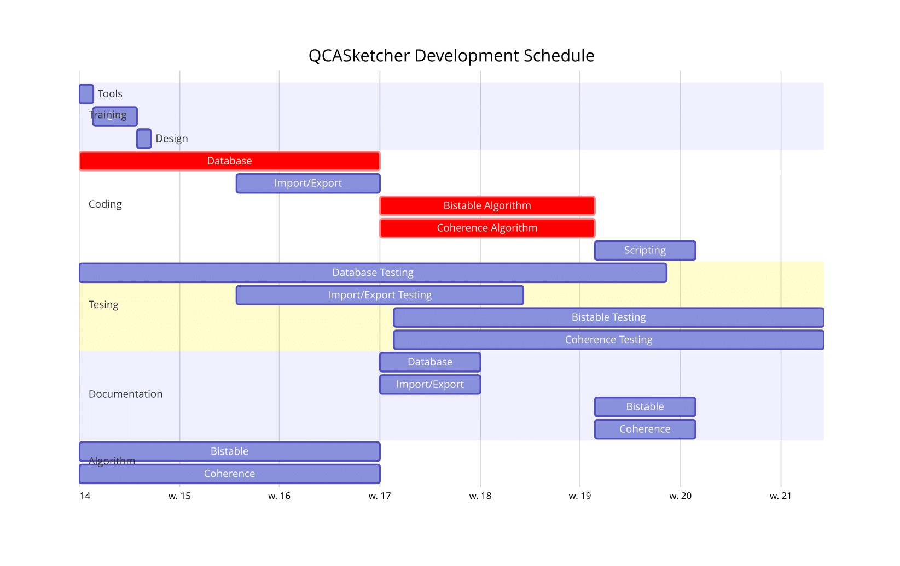

====================
System Architecture
====================

.. image:: images/qcas_architecture_diagram.png

The diagram above illustrates the QCASketcher's architecture design, which is basically a three layered system. The most important component is the **in memory data structure**. In fact, it is an object model for QCA simulations. Every other components are built around it. For example, the import/export layer is used to setup this in memory object model from disk files according to a predefined data schema.  Above the object layer,  simulation engines are composed of some dedicated algorithms that differs from speed to accuracy.  Design manipulation API provides a interface for design object operation, such as adding cell, removing cell etc. Both simulation algorithms and manipulation functions are packaged in a thin layer called QCA Circuit Design API, which is used by the different user interfaces. There are three user interfaces in total, which are GUI, scripting and DSL.

