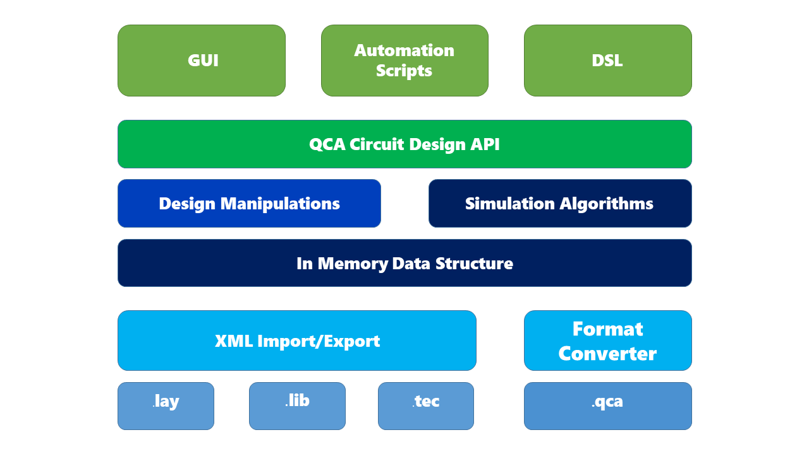

====================
System Architecture
====================

The diagram above illustrates the QCASketcher's architecture design, which is basically a three layered system. The most important component is the **in memory data structure**. In fact, it is an object model for QCA simulations. Every other components are built around it. For example, the import/export layer is used to setup this in memory object model from disk files according to a predefined data schema.  Above the object layer,  simulation engines are composed of some dedicated algorithms that differs from speed to accuracy.  Design manipulation API provides a interface for design object operation, such as adding cell, removing cell etc. Both simulation algorithms and manipulation functions are packaged in a thin layer called QCA Circuit Design API, which is used by the different user interfaces. There are three user interfaces in total, which are GUI, scripting and DSL.

.. mermaid:: 

    gantt    
    dateFormat  YYYY-MM-DD    
    title QCASketcher Development Schedule
    section Training
    Tools  : task1, 2018-04-09, 2018-04-10
    C++ : task2, after task1, 3d
    Design       : task3, after task2, 1d
    section Coding
    Database : crit, db, 2018-04-09, 2018-04-30
    Import/Export : imexport, 2018-04-20, 2018-04-30
    Bistable Algorithm : crit, bistable, after imexport, 15d
    Coherence Algorithm: crit, coherence, after imexport, 15d
    Scripting: python, after bistable, 7d
    section Tesing
    Database Testing : tdb, 2018-04-09, 2018-05-20
    Import/Export Testing : timexport, 2018-04-20, 2018-05-10
    Bistable Testing  : tbistable, 2018-05-01, 30d   
    Coherence Testing : tcoherence, 2018-05-01, 30d   
    section Documentation    
    Database  : ddb, after db ,7d    
    Import/Export  : dimexport, after imexport, 7d    
    Bistable : dbistable, after bistable, 7d
    Coherence : dcoherence, after bistable, 7d
    section Algorithm   
    Bistable : abistable, 2018-04-09, 2018-04-30    
    Coherence : coherence, 2018-04-09, 2018-04-30

